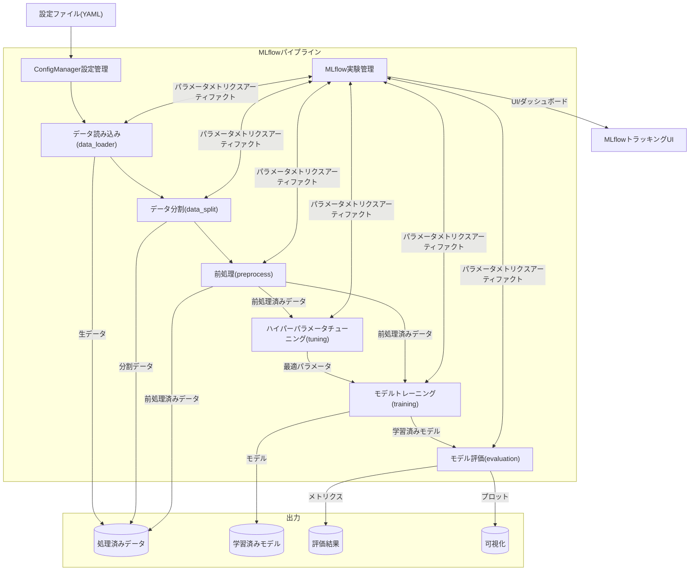
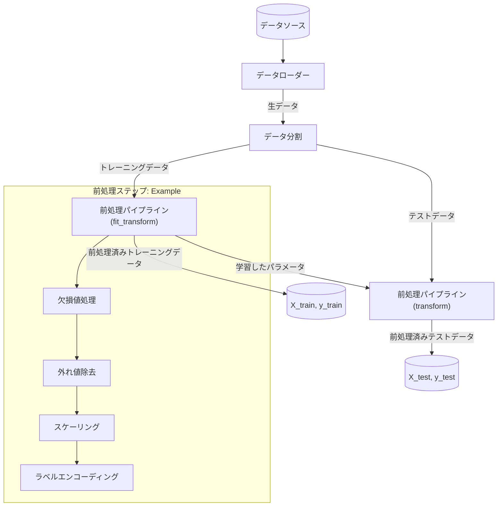
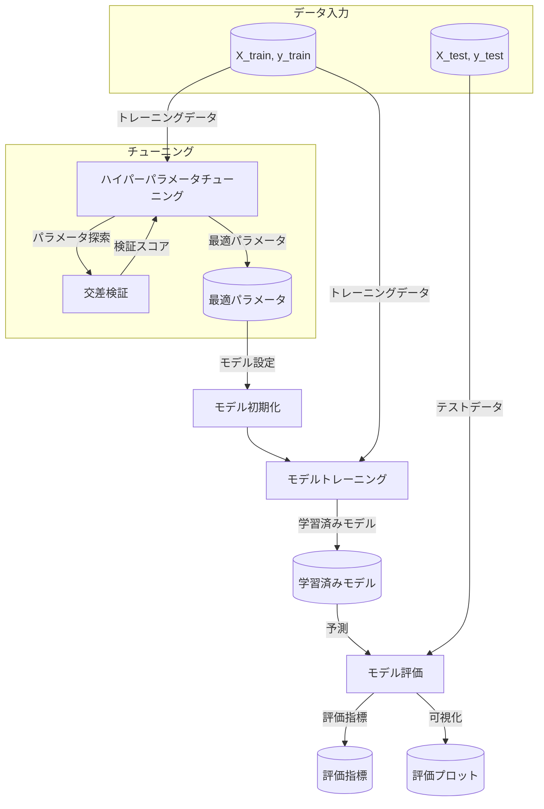
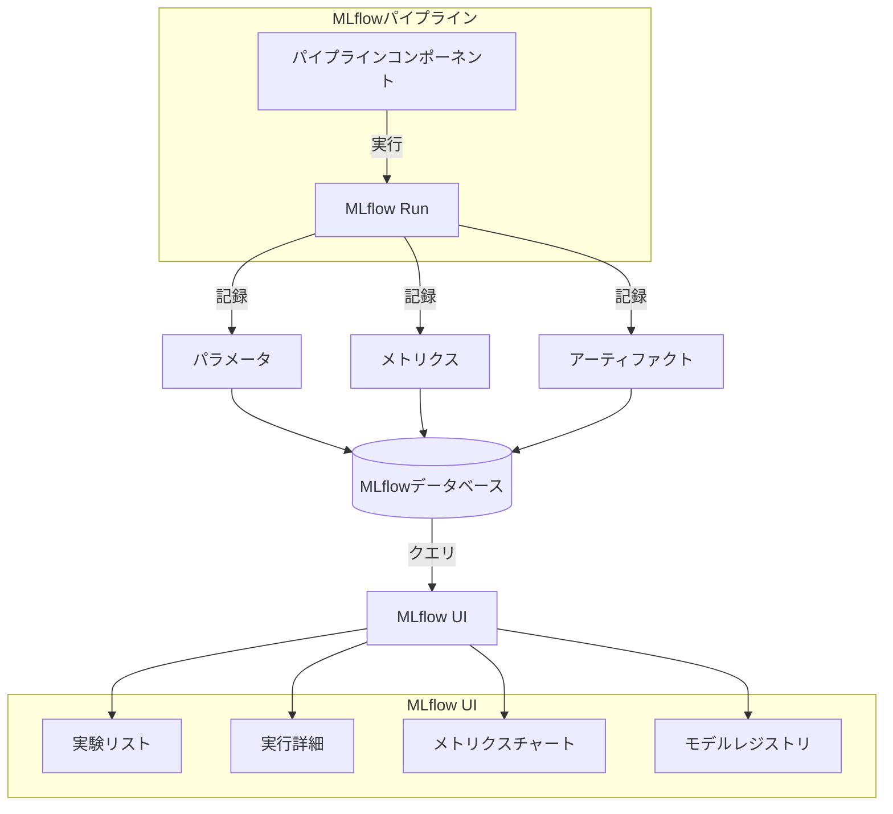
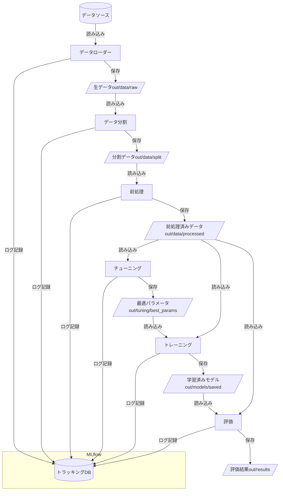

# 機械学習ワークフローダイアグラム

## MLflowベースの機械学習パイプライン

以下のダイアグラムは、本フレームワークの機械学習ワークフローを示しています。MLflowを中心としたパイプラインの構造と各コンポーネントの連携が表現されています。

## データ処理プロセス

以下のダイアグラムは、データ読み込みから前処理までの詳細なプロセスを示しています。

## モデルトレーニングとチューニング

以下のダイアグラムは、モデルトレーニング、交差検証、ハイパーパラメータチューニングのプロセスを示しています。

## MLflow実験管理

以下のダイアグラムは、MLflowを使用した実験管理とトラッキングを示しています。

## コンポーネント間のデータフロー

以下のダイアグラムは、主要コンポーネント間のデータフローとファイル保存を示しています。

